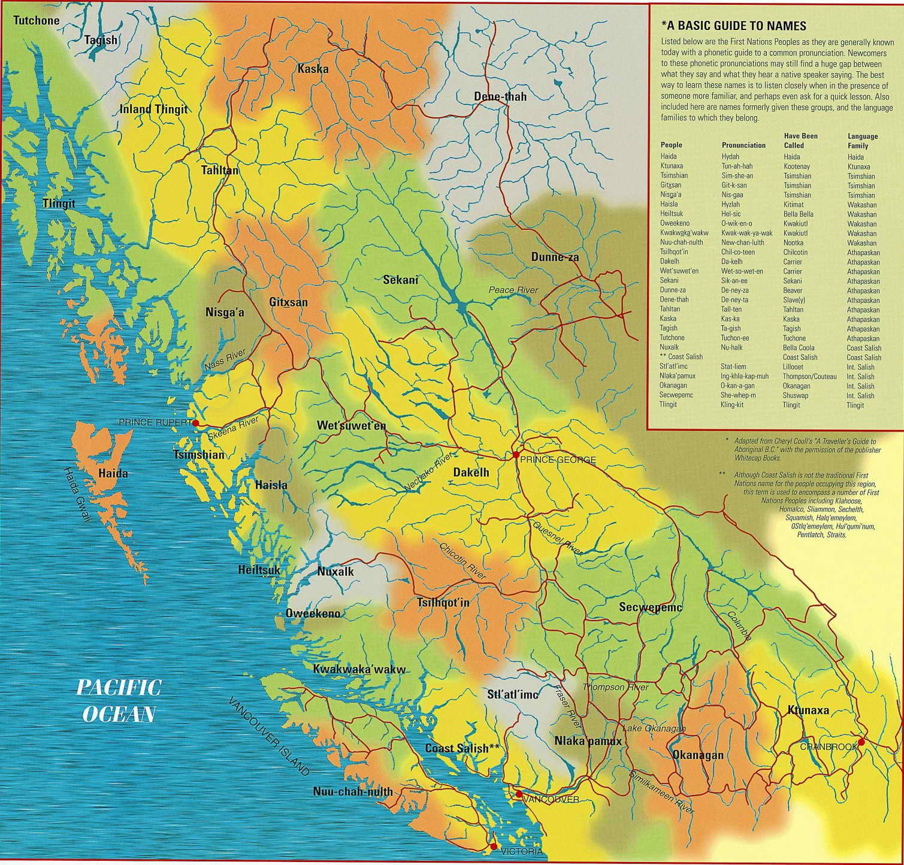

# Territorial and Cultural Acknowledgement

The University of British Columbia and the city of Vancouver are on the traditional, ancestral, and unceded territory of the Coast Salish Peoples.  Specifically the xʷməθkʷəy̓əm (Musqueam), əl̓ilwətaɁɬ (Tsleil-Waututh), and Skwxwú7mesh-ulh (Squamish) Nations.  There are nearly 200 First Nations spread through BC, and many more across the continent.

<a href="https://opentextbc.ca/indigenizationfoundations/chapter/acknowledging-traditional-territories/" target="_blank">Map Source</a>

---

# Why Do an Acknowledgement?

For centuries, settler societies have perpetuated a genocide against Indigenous people across the globe.  In many ways this genocide is still ongoing here in British Columbia and across Canada.  There has been concerted effort by the government, religious organizations, and educational institutions to erase Indigenous cultures and identity from both the land and the map.  Historically, maps have been used as tools of oppression and we must work to de-colonize our practices in GIS.  A land acknowledgement is one small way to help with that.  It isn't just a formality.  It is a time to reflect and build understanding.  To learn more about the Indigenous people, culture, and languages where you live and around the world, check out [native-land.ca](https://native-land.ca/).

## What Does it Mean?

What do we mean when we say **traditional**, **ancestral**, and **unceded territory**?  It is meant to convey a deep rooted cultural connection to the land and coven the historical and present day injustices and violence enacted on Indigenous communities through colonialism.

### **Traditional**

Recognizes that the lands were traditionally used and/or occupied.  The [xʷməθkʷəy̓əm](https://native-land.ca/maps/territories/x%ca%b7m%c9%99%ce%b8k%ca%b7%c9%99y%cc%93%c9%99m/), [əl̓ilwətaɁɬ](https://native-land.ca/maps/territories/tsleil-waututh-s%c9%99l%cc%93ilw%c9%99ta%c9%82%c9%ac/), and [Skwxwú7mesh-ulh](https://native-land.ca/maps/territories/skwxwu7mesh-uxwumixw/) Nations have traditionally occupied this area.

<iframe src="https://native-land.ca/api/embed/embed.html?maps=territories&name=skwxw7mesh-xwumixw,tsleil-waututh-səl̓ilwətaɂɬ,xʷməθkʷəy̓əm" style="width:100%; height:400px; border:none;"></iframe>

### **Ancestral**

Recognizes territories and cultures have been handed down from generation to generation.  One example is language, which has strong connections to ancestry.  The xʷməθkʷəy̓əm and əl̓ilwətaɁɬ speak dialects of [Hul’q’umi’num’ / Halq’eméylem / hən̓q̓əmin̓əm̓](https://native-land.ca/maps/languages/hulquminum-halqemeylem-h%c9%99n%cc%93q%cc%93%c9%99min%cc%93%c9%99m%cc%93/) and the Skwxwú7mesh-ulh speak [Sḵwx̱wú7mesh sníchim](https://native-land.ca/maps/languages/s%e1%b8%b5wx%cc%b1wu7mesh-snichim/).

<iframe src="https://native-land.ca/api/embed/embed.html?maps=languages&name=hulquminum--halqemylem--hnqminm,swxw7mesh-snchim" style="width:100%; height:400px; border:none;"></iframe>

### **Unceded**

Refers to land that was not turned over to the government by a treaty or other agreement.  Over 95% of the land in BC, and many lands elsewhere in the world were never ceded by treaty.  Without treaties, these lands remain the sovereign territory of the First Nations that call them home.  Yet at the same time, the lands have been claimed by Canada and these First Nations living on these lands lack a framework to express their sovereignty.  This by no means absolves the Canadian government of their crimes where lands were "ceded" by treaty.  Treaties were more frequently reached by coercion than negotiation.  The [RCMP](https://www.cbc.ca/listen/cbc-podcasts/203-the-secret-life-of-canada/episode/15798131-s3-the-mounties-always-get-their-land-part-1) was created specifically to force indigenous people off their lands by any means necessary.

<iframe src="https://native-land.ca/api/embed/embed.html?maps=treaties" style="width:100%; height:400px; border:none;"></iframe>
