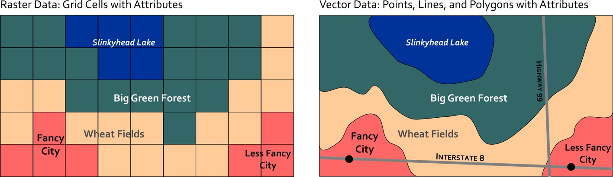

# Why Python?

Its a great language! But its not the only language. Just as English, Cantonese, or Punjabi could all be used to explain systemic racism; Python, Javascirpt, or R can all be used to quantify and visualize the scale of the problem.   like python because its very flexible, fairly easy to read / write, well suited for data analysis, has lots of packages for GIS, and it's completely free!

## Packages

Python has a number of built in functionality, but many of the most useful tools and functions come require us to [import](https://docs.python.org/3/reference/simple_stmts.html#import) packages.

* Packages are pre-written blocks of code, sometimes referred to as libraries.
* They are built for addressing specific tasks: e.g. linear algebra, mapping, plotting.

# Geospatial Analysis

There are two main data models we use to represent spatial information in GIS.  The **Vector** data model represents spatial features as points, lines, and/or polygons, and stores attributes about them in an associated attribute table.  The **Raster** data model represents spatial features as a continuous grid of cells, with each cell storing one attribute.  

For working with vector data, [Geopandas](https://geopandas.org/) is one of your best options.  It is a spatial extension for pandas, a popular package for handling tabular datasets. For working with raster data, [Rasterio](https://rasterio.readthedocs.io/en/latest/) is a good option.  The key reason we need special packages for working with spatial data is because we need to be able to manage different spatial reference systems. 

