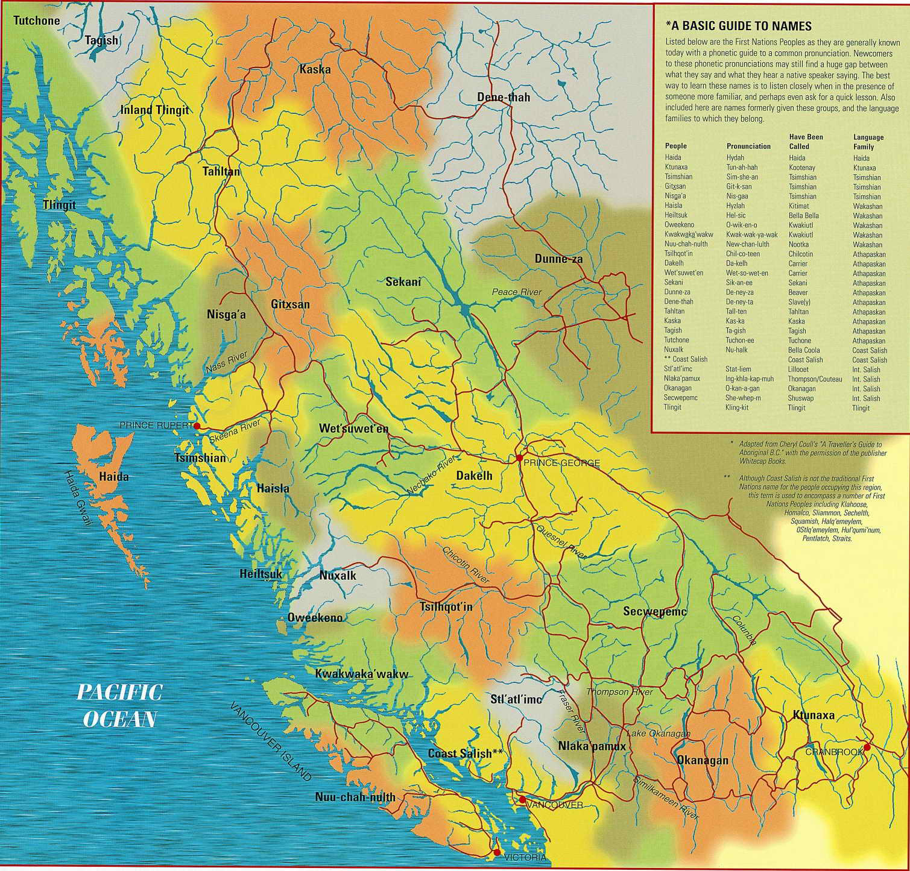

# Geospatial Analysis and Visualization with Python
{: .no_toc }

Workshop created by June Skeeter june.skeeter@mubc.ca for the UBC Library Search Commons.

  

    Table of contents
  

  {: .text-delta }
1. TOC
{:toc}

# Content Warning

This workshop deals with a difficult and painful subject that may be triggering to some, especially BIPOC individuals.  We are going to use a dataset of police killings and police involved deaths in Canada.  The intent behind choosing this dataset end goal of this workshop is to show that GIS, programming, data analysis, and data visualization can be powerful tools for promoting social and environmental justice issues.

# Learning Objectives

1) Cursory overview to python

2) Introduction to geospatial analysis data with python

3) Creating geospatial visualizations with python

# Why Police-Involved Deaths in Canada?

Racism is ingrained in the history of policing in Canada since the founding of the Royal Canadian Mounted Police (RCMP) in 1873.  Police in Canada play a central tool in Canada's ongoing genocide of Indigenous people, actively work to oppress BIPOC communities, and maintain systems of oppression in Canadian society.  Police institutions exist to do the bidding of those in power, not protect the public.

Canadian institutions rely on the lack of race based statistics and other demographic information to perpetuate a narrative that systemic racism is "just an American issue" and that Canada is "better".  As a white settler and immigrant from the United States, I fell for that narrative and did not question it for years.  
* We need to have discussions about systemic racism in Canada and make it part of the public discourse in order to hold Canadian institutions accountable.

## Notes on Terminology

**Police Killing:** A death directly resulting from police use of force.  Including but not limited to: shooting, tazing, other use of force.

**Police-Involved Deaths**  Any civilian death at the hands of police or in the custody of police.  Includes police killings deaths resulting from police negligence/inaction: suicide, overdoses, medical emergencies, etc.  This is broader term that is more difficult to refute on the grounds of semantics.  

## Increasing Police Violence in Canada

There has been an [increasing trend](https://police-involved-deaths-ca.github.io/Data/#increasing-police-violence-in-canada) in deaths at the hands of Canadian Police over recent years.  This may be partly an result of greater access to information, but it is also probable that Canadian Police *are* becoming more violent.

# Territorial Acknowledgement

UBC and the city of Vancouver are on the traditional, ancestral, and unceded territory of the Coast Salish Peoples.  Specifically the xʷməθkʷəy̓əm (Musqueam), əl̓ilwətaɁɬ (Tsleil-Waututh), and Skwxwú7mesh-ulh (Squamish) Nations.

<a href="https://opentextbc.ca/indigenizationfoundations/chapter/acknowledging-traditional-territories/" target="_blank">Map Source</a>

## Why Do a Territorial Acknowledgement?

For centuries, settler societies have perpetuated a genocide against Indigenous people across the globe.  In many ways this genocide is still ongoing here in British Columbia and across Canada.  There has been concerted effort by the government, religious organizations, and educational institutions to erase Indigenous cultures and identity from both the land and the map.  Historically, maps have been used as tools of oppression and we must work to de-colonize our practices in GIS.  A land acknowledgement is one small way to help with that.  It isn't just a formality.  It is a time to reflect and build understanding.  The maps and information presented below are sourced from [native-land.ca](https://native-land.ca/).  

## What Does it Mean?

Why do we say *traditional, ancestral, and unceded territory*?

**Traditional**: recognizes that the lands were traditionally used and/or occupied.  The [xʷməθkʷəy̓əm](https://native-land.ca/maps/territories/x%ca%b7m%c9%99%ce%b8k%ca%b7%c9%99y%cc%93%c9%99m/), and [əl̓ilwətaɁɬ](https://native-land.ca/maps/territories/tsleil-waututh-s%c9%99l%cc%93ilw%c9%99ta%c9%82%c9%ac/), [Skwxwú7mesh-ulh](https://native-land.ca/maps/territories/skwxwu7mesh-uxwumixw/)Nations have traditionally occupied this area.

<iframe src="https://native-land.ca/api/embed/embed.html?maps=territories&name=skwxw7mesh-xwumixw,tsleil-waututh-səl̓ilwətaɂɬ,xʷməθkʷəy̓əm" style="width:80%; height:400px; border:none;"></iframe>

**Ancestral**: recognizes land that is handed down from generation to generation.  It is meant to convey a deep rooted connection to the land.  Language has strong connections to ancestry.  The xʷməθkʷəy̓əm and əl̓ilwətaɁɬ speak dialects of [Hul’q’umi’num’ / Halq’eméylem / hən̓q̓əmin̓əm̓](https://native-land.ca/maps/languages/hulquminum-halqemeylem-h%c9%99n%cc%93q%cc%93%c9%99min%cc%93%c9%99m%cc%93/) and the Skwxwú7mesh-ulh speak [Sḵwx̱wú7mesh sníchim](https://native-land.ca/maps/languages/s%e1%b8%b5wx%cc%b1wu7mesh-snichim/).

<iframe src="https://native-land.ca/api/embed/embed.html?maps=languages&name=hulquminum--halqemylem--hnqminm,swxw7mesh-snchim" style="width:80%; height:400px; border:none;"></iframe>

**Unceded**: refers to land that was not turned over to the Crown (government) by a treaty or other agreement.  Over 95% of the land in BC was never ceded by treaty.

<iframe src="https://native-land.ca/api/embed/embed.html?maps=treaties" style="width:80%; height:400px; border:none;"></iframe>

